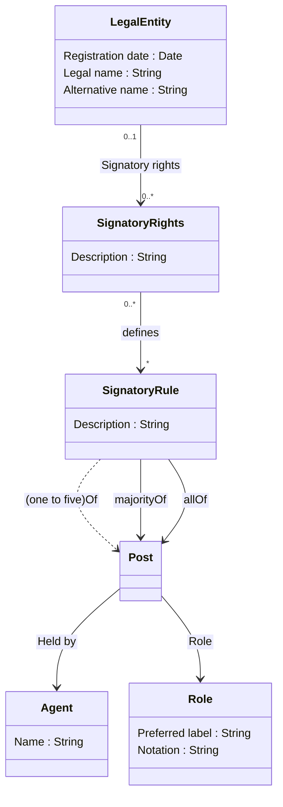

# Nordic Smart Government Signatory Rights Model

The model describes Signatory Rights as an collection of Signatory Rules that defines required combination of agents (Person/Legal entity) holding a position (Post) in an organisation (Legal entity). Agent can hold one to many positions in an organisation and can acquire signatory power trough multiple signatory rules.

## Signatory rights

Describes mandate that gives power to agent(s) to represent a legal entity trough a post in a legal entity. Signatory rights can be defined as free text or structured as machine readable signatory rules.

## Signatory rule

Structured rules that dictate the combination of posts, roles and agents to whom the representation power is granted. Rules can be used to define signatory rights that are granted alone or jointly. The rule is interpreted jointly if it points to multiple posts using restriction properties. For example one of from one post and majority of from another post in the legal entity.

## Post

A Post represents some position within an organization that exists independently of the agent or agents filling it. A post can be held by multiple persons or legal entities. The Post concept is reused from the W3C Organization ontology.

## Restriction properties

Signatory rights are commonly granted to an agent or a group of agents trough a post and a role in an organisation. The rights can be granted to an agent acting alone or jointly with another agents. Typically these type of rules have been described as freeform text which can be structured using following classification:

* One of
* Two of
* Three of
* Four of
* Five of
* Majority of
* All of

Restrictions one to five, majority and all of are modelled as properties (instead of separate class) to simplify the model. Restriction properties are used by Signatory rules to constraint the number of agents needed to form a group that can hold the signatory power.
 