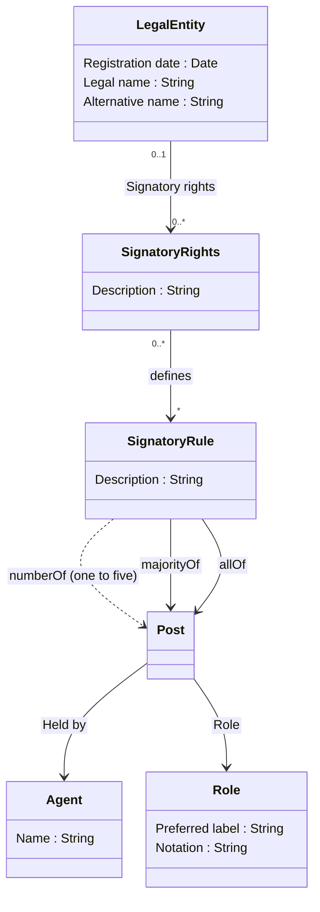

# Nordic Smart Government Signatory Rights Model

The model describes Signatory Rights as an collection of Signatory Rules that defines required combination of agents (Person/Legal entity) holding a position (Post) in an organisation (Legal entity). Agent can hold one to many positions in an organisation and can acquire signatory power trough multiple signatory rules.

This model is a subset of [Nordic Smart Government data model](https://tietomallit.suomi.fi/model/nsgb) and a suggestion for generic approach of how to model signatory rights within European Union.

TBD! Document relation to [CCEV ontology](https://semiceu.github.io/CCCEV/releases/2.00/) and [RPaM ontology](https://github.com/everis-rpam/RPaM-Ontology/wiki/Conceptual-Model-v1.1).

## Legal entity

A self-employed person, company, or organization that has legal rights and obligations.

Class reused from [Core business vocabulary](https://semiceu.github.io/Core-Business-Vocabulary/releases/2.1.0/#Agent).

## Signatory rights

Describes mandate that gives power to agent(s) to represent a legal entity alone or jointly trough a post(s) in a legal entity. Signatory rights can be defined as free text or structured as machine readable signatory rules.

Subclass of [Criterion](https://semiceu.github.io/CCCEV/releases/2.00/#Criterion).

## Signatory rule

Structured rules that dictate the combination of posts, roles and agents to whom the representation power is granted. Rules can be used to structure signatory rights that can be granted alone to an individual agent or jointly for group of agents. The rule is interpreted jointly if it points to multiple posts using restriction properties.

Subclass of [Constraint](https://semiceu.github.io/CCCEV/releases/2.00/#Constraint).

## Post

A Post represents some position within an organization that exists independently of the agent or agents filling it. A post can be held by multiple persons or legal entities. 

There can be multiple Posts using the same Role for different responsibilities and signatory rights. For example if Signatory right is given to external personnel, one agent may have signatory rights alone and other agents with the same role can have signatory rights jointly.

The Post concept is reused from the [W3C Organization ontology](https://www.w3.org/TR/vocab-org/#class-post).

## Restriction properties

Signatory rights are commonly granted to an agent or a group of agents holding a post and a role in an organisation. The rights can be granted to an agent acting alone or jointly with another agents. Typically these type of rules have been described as freeform text which can be structured using following restrictions:

* Majority of
* All of
* One of
* Two of
* Three of
* Four of
* Five of

The model defines these restrictions as properties to be used by the Signatory Rules to constraint number of agents needed from Posts to have a signatory power to a Legal Entity.

* **constraintOf** (abstract) defines constraint for a spesific post

  * **majorityOf** requires majority of agents holding a post to sign.

  * **allOf** requires all of the agents holding a post to sign.

  * **numberOf** (abstract) requires defined number of agents holding a post to sign:
    * oneOf
    * twoOf
    * threeOf
    * fourOf
    * fiveOf

*Note: The need for numeric constraint was only up to 5 in all of Nordic countries. If requirement arises to model arbitrary numeric constraints this could be done using qualified relations, for example numberOf property and a blank node (or custom class) using rdf:value instead of creating explicit properties.*

## Agent

Entity that is able to carry out action. 

Class reused from FOAF / [Core business vocabulary](https://semiceu.github.io/Core-Business-Vocabulary/releases/2.1.0/#Agent).

## Role
 
 Denotes a role that a Person or other Agent can take in an organization. 
 
 Class reused from [Organisation ontology](https://www.w3.org/TR/vocab-org/#class-role).

 TBD!

 NSG&B defines set of roles to be used as classification.

 # Examples

 TBD!

 Some text examples and point to RDF examples. TBD!