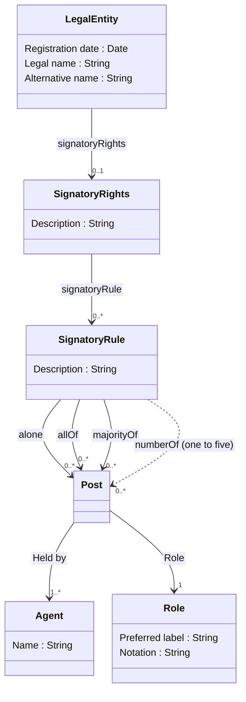

# Nordic Smart Government Signatory Rights Model

The model describes Signatory Rights as an collection of Signatory Rules that defines required combination of agents (Person/Legal entity) holding a position (Post) in an organisation (Legal entity). Agent can hold one to many positions in an organisation and can acquire signatory power trough multiple signatory rules.

This model is a subset of [Nordic Smart Government data model](https://tietomallit.suomi.fi/model/nsgb) and a suggestion for generic approach of how to model signatory rights within European Union.

The model is defined as subclasses of [Core Criterion and Core Evidence Vocabulary](https://semiceu.github.io/CCCEV/releases/2.00/) defining more detailed conditions and constraints for Signatory rights. The model is also related to [Core Vocabulary of Powers and Mandates](https://github.com/everis-rpam/RPaM-Ontology/wiki/Conceptual-Model-v1.1), which could be used to further define the type of the mandate. However, the Signatory rights model focuses mainly on defining machine readable rules for determining if an Agent or group of Agents has the signatory power.

## Legal entity

A self-employed person, company, or organization that has legal rights and obligations.

Class reused from [Core business vocabulary](https://semiceu.github.io/Core-Business-Vocabulary/releases/2.1.0/#Agent).

### Properties

**signatoryRights**: Relation from Legal Entity to Signatory Rights

Note: Also other relevant properties from the Legal Entity.

## Signatory rights

Criterion for a mandate that gives power to agent(s) to represent a legal entity alone or jointly trough a post(s) in a legal entity. Signatory rights can be defined as free text or structured as machine readable signatory rules.

Subclass of [Criterion](https://semiceu.github.io/CCCEV/releases/2.00/#Criterion).

### Properties

**description**: Free text description for the Signatory rights

**signatoryRule**: Relation to structured signatory rule. Each referenced rule can give an agent or group of agents the signatory power (interpreted as OR clause).

## Signatory rule

Structured constraints for the Agents required to sign on behalf of a Legal Entity. The existence of signatory power can be determined from the combination of constraint properties that define the required number of Posts and Roles to be held by the Agents."

Subclass of [Constraint](https://semiceu.github.io/CCCEV/releases/2.00/#Constraint).

Typically signatory rights have been described as freeform text which can be structured using following restrictions:

* Alone
* Jointly
  * All of
  * Majority of
  * One of
  * Two of
  * Three of
  * Four of
  * Five of

The model defines these restrictions as properties to be used by the Signatory Rules to constraint number of agents needed from Posts to have a signatory power to a Legal Entity.

*Notes:*

*The instance of signatory rule is interpreted jointly (AND clause) if it points to many Posts using multiple restriction properties.*

### Properties

* **constraint** (abstract) defines constraint for a spesific post

  * **alone** requires exactly one of the agents holding a post to sign.

  * **jointly** (abstract) requires the agents holding a post to sign jointly according to the rules
  
    * **allOf** requires all of the agents holding a post to sign.

    * **majorityOf** requires majority of agents holding a post to sign.

    * **numberOf** (abstract) requires defined number of agents holding a post to sign from a larger group of agents.
      * **oneOf**
      * **twoOf**
      * **threeOf**
      * **fourOf**
      * **fiveOf**

*Notes for the numeric constraints:*

1. *There should always be at least one more agent holding a post than the required number of signatories when using numberOf constraint*

2. *The need for numeric constraint was only up to 5 in all of Nordic countries. If requirement arises to model arbitrary numeric constraints this could be done using qualified relations, for example numberOf property and a blank node (or custom class) using rdf:value instead of creating explicit properties.* 

## Post

A Post represents some position within an organization that exists independently of the agent or agents filling it. A post can be held by multiple persons or legal entities. 

There can be multiple Posts using the same Role for different responsibilities and signatory rights. For example if Signatory right is given to external personnel, one agent may have signatory rights alone and other agents with the same role can have signatory rights jointly.

The Post concept is reused from the [W3C Organization ontology](https://www.w3.org/TR/vocab-org/#class-post).

### Properties

**role** Points to a role for the Post

**heldBy** Points to agents holding the Post

Note: Could have identifier and description if needed

## Agent

Entity that is able to carry out action.

Class reused from FOAF / [Core business vocabulary](https://semiceu.github.io/Core-Business-Vocabulary/releases/2.1.0/#Agent).

### Properties

All properties required to define the agent

## Role

Denotes a role that a Person or other Agent can take in an organization. 

Class reused from [Organisation ontology](https://www.w3.org/TR/vocab-org/#class-role).

### Properties

**preferredLabel** Label for the role
**notation** Identifier for the code in text form
**inScheme** Reference to the classification

TBD! NSG&B defines set of roles to be used as classification.

 # Examples

See [Examples](https://github.com/nordicsmartgovernment/Nordic-Smart-Government-Datamodel-Examples/tree/main/Examples) folder